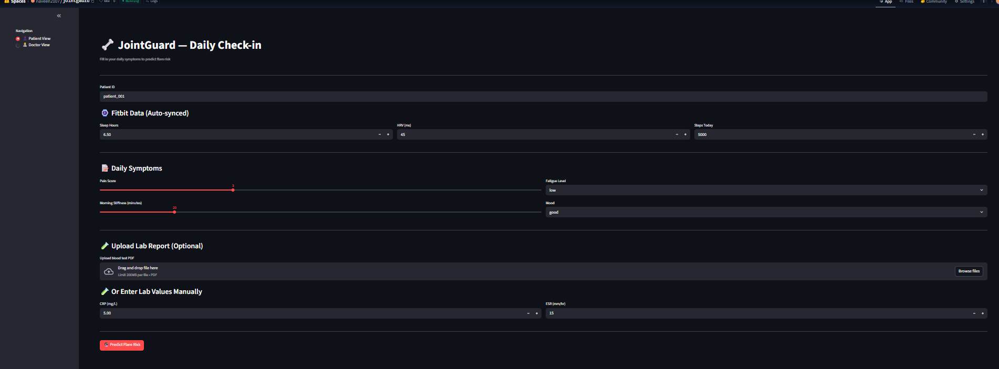

# 🦴 JointGuard

> **AI-Powered Rheumatoid Arthritis Flare Prediction using MedGemma 4B, LangGraph, FastAPI, and Streamlit**

JointGuard is an AI-powered healthcare application that predicts **Rheumatoid Arthritis (RA) flare-ups up to 48 hours in advance** by combining wearable sensor data, patient symptoms, laboratory reports, and Large Language Models (LLMs).

The system assists patients by providing early risk prediction, AI-generated clinical insights, and personalized recommendations for proactive disease management.

---

# 📌 Problem Statement

Rheumatoid Arthritis is a chronic autoimmune disease where flare-ups often occur unexpectedly, leading to severe pain, inflammation, and reduced quality of life.

Traditional monitoring depends on periodic hospital visits and laboratory tests, making early intervention difficult.

JointGuard addresses this challenge by continuously analyzing wearable data, patient symptoms, and laboratory reports to predict flare risk before symptoms become severe.

---

# ✨ Features

- Daily symptom tracking
- Fitbit wearable data integration
- Blood report (PDF) upload
- Manual laboratory value entry
- AI-powered flare prediction
- Personalized health recommendations
- Real-time flare risk visualization
- Interactive Streamlit dashboard

---

# 👤 Patient Dashboard

The patient dashboard provides a simple interface for recording daily health information and receiving AI-generated flare predictions.

### Patient Inputs

- Pain Score
- Morning Stiffness
- Fatigue Level
- Mood
- Sleep Hours
- Heart Rate Variability (HRV)
- Daily Steps
- C-Reactive Protein (CRP)
- Erythrocyte Sedimentation Rate (ESR)

### Dashboard Highlights

- Daily health check-in
- Wearable sensor monitoring
- Laboratory report upload
- Manual lab value entry
- AI-powered flare prediction
- Personalized action recommendations
- Real-time risk assessment

---

# 🧠 AI Workflow

```text
Wearable Data (Fitbit)
        │
        ▼
Patient Symptoms
        │
        ▼
Laboratory Reports (PDF)
        │
        ▼
PyMuPDF Document Parser
        │
        ▼
LangGraph Agent Workflow
        │
        ▼
MedGemma 4B
        │
        ▼
Risk Prediction Engine
        │
        ▼
Streamlit Dashboard
```

---

# 🛠️ Technology Stack

| Category | Technology |
|----------|------------|
| Programming Language | Python |
| Large Language Model | MedGemma 4B |
| AI Framework | LangGraph |
| Frontend | Streamlit |
| Backend | FastAPI |
| Database | Supabase |
| PDF Processing | PyMuPDF |
| Machine Learning | Hugging Face Transformers |
| Deep Learning | PyTorch |
| Deployment | Hugging Face Spaces |
| Containerization | Docker |

---

# 📂 Project Structure

```text
joint_guard/
│
├── app.py
├── Dockerfile
├── requirements.txt
├── joint-gaurd.ipynb
└── screenshots/
```

---

# 📷 Screenshots

## Patient Dashboard



---

# 🎯 Future Improvements

- Real-time Fitbit API integration
- Electronic Health Record (EHR) integration
- FHIR support
- Explainable AI (XAI)
- Multi-patient monitoring
- Automated doctor notifications
- Mobile application
- Long-term disease progression analytics

---

# 🙏 Acknowledgements

JointGuard demonstrates how Large Language Models and AI agents can be integrated into healthcare applications for intelligent decision support. The project combines wearable sensor data, laboratory reports, and patient-reported symptoms with generative AI to predict Rheumatoid Arthritis flare-ups and support timely clinical interventions.

---

⭐ **If you found this project interesting, consider giving the repository a star.**